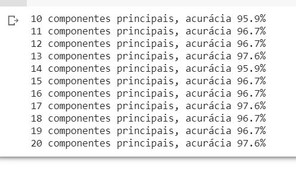

## FURB - Curso de Especialização em Data Science  - Turma 2
## Disciplina de Aprendizado de Máquina II - Aprendizado Não Supervisionado
### Professor Mácio Koch
### Trabalho de avaliação 
### Aluno: Mauro Schramm
-------------------

### Descrição Geral

Trabalho desenvolvido na linguagem Python a partir do exemplo em Java desenvolvido pelo professor em aula. Trata-se da aplicação da técnica de análise das componentes principais (PCA, na sigla em inglês) através da biblioteca de visão computacional OpenCV. Não foi realizada uma nova implementação do algoritmo da PCA. 

[Enunciado do trabalho](./aux/enunciado.pdf)

--------------

### Exemplo de execução
A figura abaixo apresenta a saída gerada pelo programa em uma execução
 

-----------------

### Instruções para execução

1. Crie um projeto no Google Colaboratory (https://colab.research.google.com/)
2. Copie o [código do programa](./Eigen_Faces_Final.ipynb) e cole em uma seção de código do projeto recém criado
3. Carregue os arquivos de imagem para a pasta raiz do sistema de arquivos no projeto do colab

